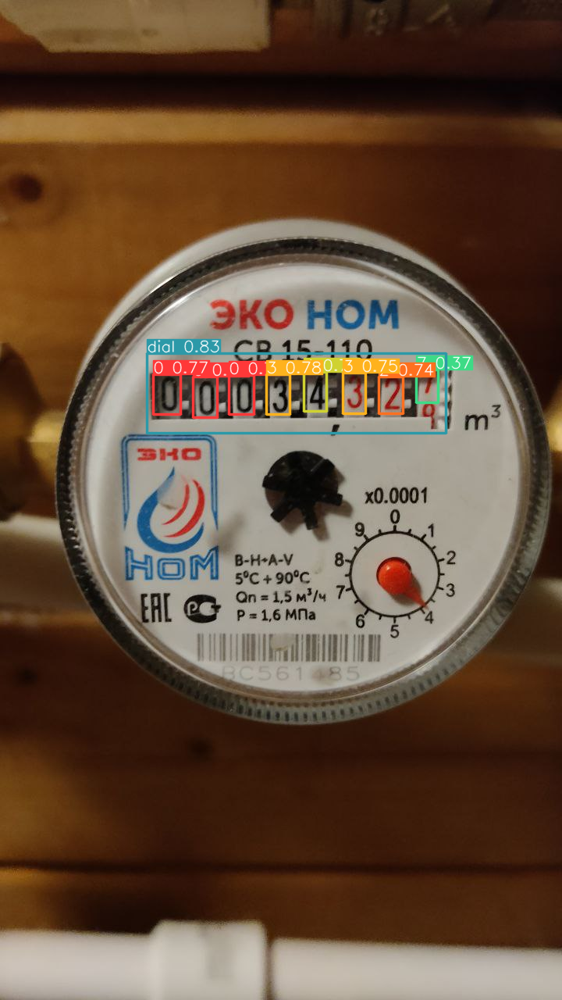

## Intro

Реализована простая API для доступа к yolo-подобной моделе компьютерного зрения. За основу была взята архитектура YOLOv7 с последующими доработками количества drop-out слоев и полносвязных слоев с измененными свертками для увеличения показателей точности вне зависимости от освещения фотографии.

## API
=======
# Легкая документация к беку
_Каждый из роутов имеет метод post. Входные данные везде {"upload_image" : image, "token" : token}_

## Сами роуты
- post('/all_values') : ответит в формате

      {"0": {
        "value": "0",
        "x": 0.29652777314186096,
        "y": 0.3941406309604645,
        "w": 0.0486111119389534,
        "h": 0.03984374925494194,
        "coef": 0.7717819809913635
          }, ...
      }
- post('/get_number'): ответит в формате 
    {
        "number": "00034327"
    }
- post('/get_coordinates'): ответит в формате:

      {"0": {
        "value": "0",
        "x": 0.29652777314186096,
        "y": 0.3941406309604645,
        "w": 0.0486111119389534,
        "h": 0.03984374925494194
          }, ...
      }

## О репозитории
К API составляющей веб-сервера относятся файлы [main.py](main.py), папки [apiUtils](apiUtils), [Content](Content)
- в файле main.py запускается web-server, принимающий запросы на эндпоинты, описанные выше. Для поиска значений на
картинках используется Neural Vision, соседствующее с веб-сервером. в файле [detect.py](detect.py) содержится функция
- папка [apiUtils](apiUtils) содержит хешер для названия сохраняемых файлов фотографий счетчиков. файл other.py хранит
функции, используемые для парсинга pandas Dataframe и проверки соответствия "коробки" dial со значениями с координатами значений (они должны быть внутри коробки dial) (см. [result.png](result.png))

При обновлении файлов в репозитории удаленный сервер с помощью автоскриптов обновляет его в себе, а также запускается вместе с машиной
при ее перезапуске.